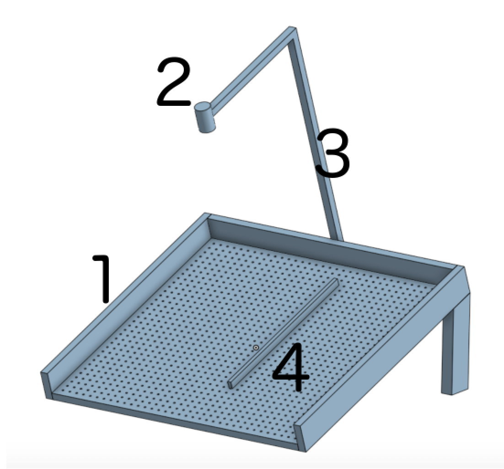
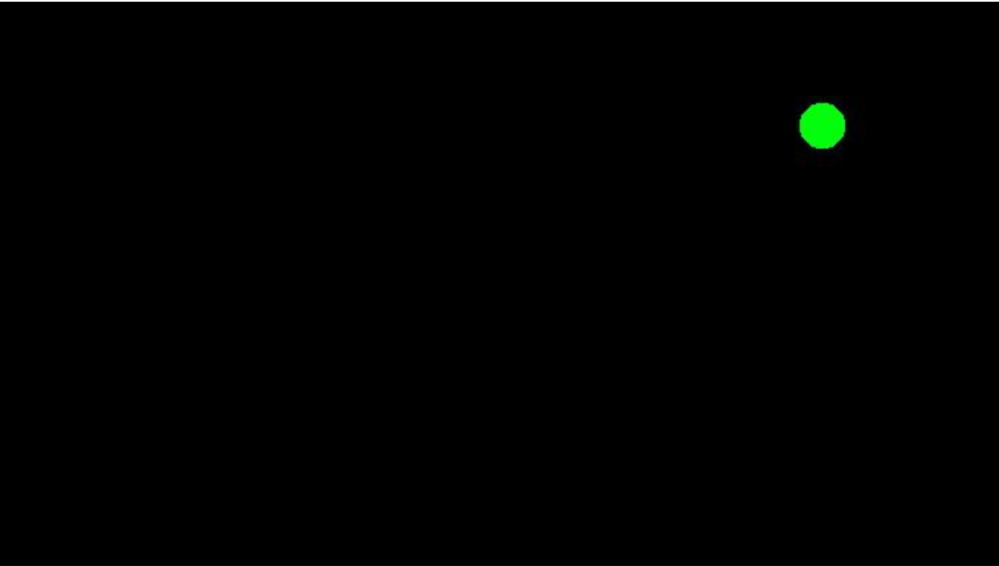
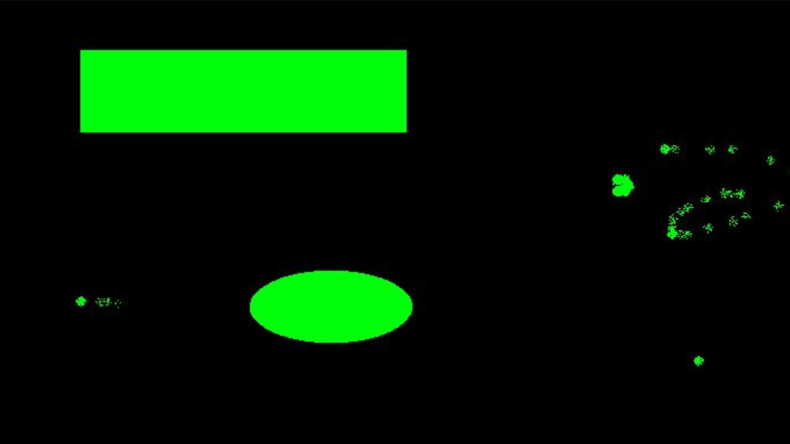

# SHIDI: Skee-ball Hyper Interactive Digital Instrument
Inspired by skee-ball, the SHIDI (Skee-ball Hyper Interactive Digital Instrument) is an electronic-musical instrument which is played by rolling balls across a surface.  

## Overview:
A video feed monitors the surface, tracking the x-y position of each ball. The x-coordinate controls pitch, and the y-coordinate controls volume. By rolling a ball from the base of the SHIDI, a user determines the pitch and volume of the instrument.
The surface, a pegboard, can have auxiliary structures attached to control the path of the balls. For example, guide rails can be inserted base-to-top of the SHIDI, enforcing discrete sets of playable notes by limiting the trajectory of the balls. 
Our software will process the video stream, mapping the positions of objects to MIDI. This MIDI data is sent to Reason. A Reason patch, uniquely assigned for each object (for example, a sin wave for one ball), recieves the MIDI data nd outputs sound. 

## Architecture:
The architecture of the SHIDI is divided into 9 components: 6 physical parts, and 3 digital modules.

### Physical:
 

1. **Board**: The board is a rectangular pegboard. On the left, right, and upper sides of the board, the board has sides to prevent balls from leaving the pegboard. On the upper side of the board there are two legs to tilt the board at an angle.
2. **Camera**: The camera is positioned above (orthogonally to the angle of the surface) the board. The camera relays data to the computer via a usb cable.
3. **Camera Mount**: the camera bound fixes the location of the camera with respect to the board.
4. **Auxiliary Rails**: Rails, or other pieces to change the layout of the pegboard that insert into the pegs.
5. **Lights** (not Shown): The board is lit with strips of LEDs mounted to the side rails.
6. **Computer** (Not shown): the computer receives and handles (see next section) the data from the camera.

### Digital:
7. **Video to entity locations**: Interpret the video feed to determine the location of each entity on the board. Done in python with *OpenCV*. 
8. **Locations to MIDI**: Convert entity locations to MIDI, using *Mido*. Each ball will have its own MIDI channel. X-Position maps to Pitch (note on + pitch bend messages), Y-Position maps to velocity (channel volume). 
9. **MIDI to Sound**:  Convert MIDI to sound, using *Reason*.

## Parts:
- Colorful balls
- Webcam (or some low-res cheap camera)
- Computer (our laptops)
- USB cable for Camera
- Plywood/MDF (for table and rails)
- 2x4s (for legs and for guide rails)
- Fasteners (nails, screws, wood glue)
- Dowels (for pegs)
- Spray paint (Black, Green, etc.)
- Black Gloves
- LED strips (For lighting the field)
- Power Cable (for lights)
- Camera mounting equipment (selfie stick? Cheap Tripod?)

## Dependencies:
- [Mido](https://github.com/olemb/mido): for writing to midi stream from python
- [OpenCV](https://opencv.org/):  for object tracking and edge detection

## Sample Data:
 
 
 
 

